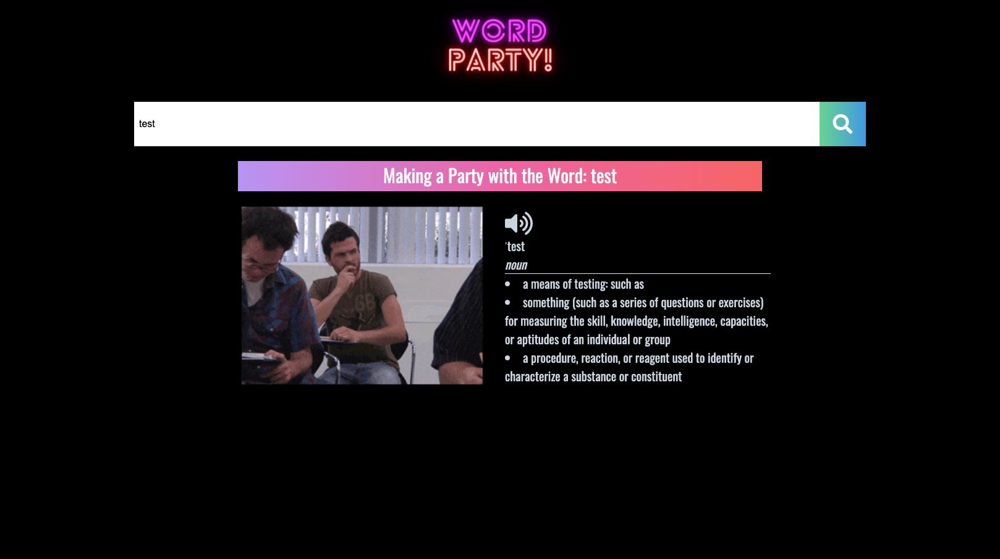

# Word-Party

For this project our team had to work together to develop a web application from scratch. We made an applicaiton called "Word Party". When the user submits a word into Word Party via the input field, Word Party returns information about the word from dictionary.com (notably definitions, pronunciation, and phonetics), and a GIF from Giphy that is associated with that word. 

The project had the following acceptance criteria:

  * Satisfies the following code requirements:

    * Application uses at least two server-side APIs.

      * Application uses client-side storage to store persistent data.

      * Application doesn't use JS alerts, prompts, or confirms (uses modals instead).

      * Application uses a CSS framework other than Bootstrap.

      * Application is interactive (accepts and responds to user input)

Here was our approach:

  * We used APIs from Dictionary.com and Giphy.com

  * We used local storage to display the word that the user submitted

  * We did not use JS alerts, prompts, or confirms, and instead used input elements in html and connect them via click listeners

  * We used the CSS framework, Tailwind.

  * The application was interactive and responsive. 

Github Pages Link: https://ericrudeen.github.io/word-party/
Github Repo Link: https://github.com/ericrudeen/word-party

